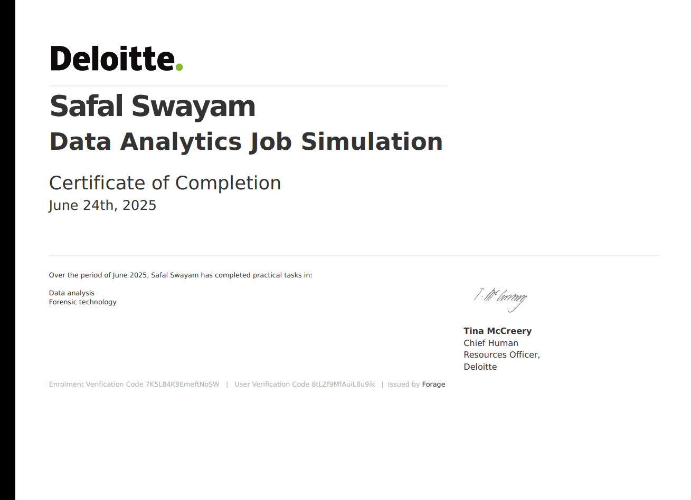

# 🌟 Safal Swayam – Portfolio

Welcome to my portfolio! I am a passionate **Master's student in Computer Applications (MCA)** with expertise in **AI, Machine Learning, Data Analytics, and Web Technologies**.

---

## 🧑‍💻 **About Me**
- 🎓 **MCA Student** at *Kalinga Institute of Industrial Technology (KIIT)*  
- 🔥 Skilled in **Python, AI/ML, Web Scraping, and Data Visualization**  
- 🏆 Certified by **Oracle, Tata, IBM, Deloitte, and Microsoft**  
- 🎯 **Goal**: To become a **leading AI Expert** and build impactful projects.

---

## 🛠 **Skills**

    
    
    
    
    
    
    
    
    

---

## 📜 **Certifications**

    
    
    
    

- **Oracle Analyst Cloud Professional** – Oracle
- **Oracle Data Science Professional** – Oracle
- **Data Fundamentals** – IBM  
- **Data Analytics Job Simulation** – Deloitte   

---

## 🚀 **Highlighted Projects**
- **Netflix Content Analysis** – Exploratory data analysis and visualization.  
- **Fake News Detection** – ML models to identify fake news.  
- **Face Restoration with GANs** – StyleGAN-based image restoration.  
- **Tumor Detection** – CNN and Transformer-based AI for medical imaging.  

---

## 📫 **Contact Me**
- **Email**: [safalswayam@gmail.com](mailto:safalswayam@gmail.com)  
- **LinkedIn**: [linkedin.com/in/safalswayam](https://www.linkedin.com/in/safal-swayam-530025304)  
- **GitHub**: [github.com/safalswayam](https://github.com/safalswayam)  

---

### *“Innovation happens when passion meets technology.”*
